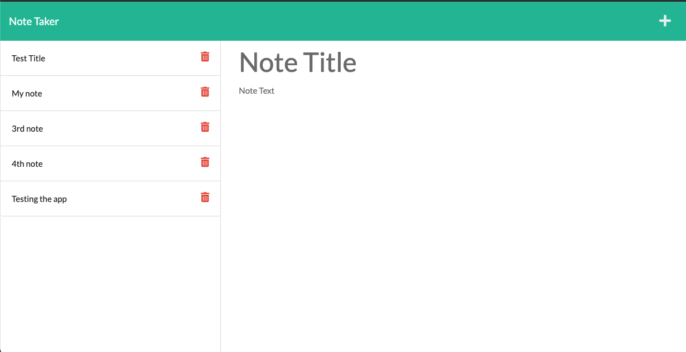
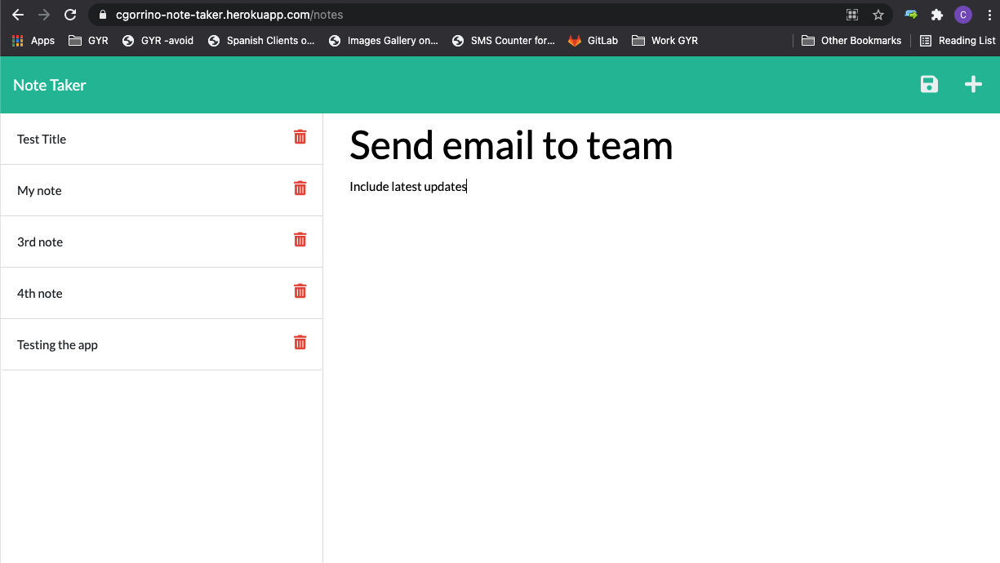

# Note Taker

## Table of Contents

1. [Description](#description)

2. [Installation](#installation)

3. [Usage](#usage)

4. [How to contribute](#contribute)

5. [How to run tests](#tests)

6. [License](#license)

7. [Questions](#questions)

## Description

This application allows the user to create, read, and delete notes through a web interface. The user can click to add a new note and save it. Saved notes are displayed on the left column of the page where they can be accessed or deleted. The app works by making requests which modify or call the data stored in the db.json file.

Deployed application: https://cgorrino-note-taker.herokuapp.com/notes

### Visuals

The pictures below demonstrate how to use the application.

## Installation
    
Use the deployed website, or clone the repo install node.js and all dependencies.

## Usage
    
Visit the website and click the plus icon to wrtie a new note. Clicking the save icon will add it to the db file and the list on screen. Use the delete icons to remove notes.

## How to contribute
    
Please contact me before making changes.

## How to run tests
    
No tests at this time.

## License
  
MIT License

        Copyright (c) [year] [fullname]
        
        Permission is hereby granted, free of charge, to any person obtaining a copy
        of this software and associated documentation files (the "Software"), to deal
        in the Software without restriction, including without limitation the rights
        to use, copy, modify, merge, publish, distribute, sublicense, and/or sell
        copies of the Software, and to permit persons to whom the Software is
        furnished to do so, subject to the following conditions:
        
        The above copyright notice and this permission notice shall be included in all
        copies or substantial portions of the Software.
        
        THE SOFTWARE IS PROVIDED "AS IS", WITHOUT WARRANTY OF ANY KIND, EXPRESS OR
        IMPLIED, INCLUDING BUT NOT LIMITED TO THE WARRANTIES OF MERCHANTABILITY,
        FITNESS FOR A PARTICULAR PURPOSE AND NONINFRINGEMENT. IN NO EVENT SHALL THE
        AUTHORS OR COPYRIGHT HOLDERS BE LIABLE FOR ANY CLAIM, DAMAGES OR OTHER
        LIABILITY, WHETHER IN AN ACTION OF CONTRACT, TORT OR OTHERWISE, ARISING FROM,
        OUT OF OR IN CONNECTION WITH THE SOFTWARE OR THE USE OR OTHER DEALINGS IN THE
        SOFTWARE.

## Questions

Contact me via email at cgorrino03@gmail.com or through my GitHub [profile](https://github.com/cristina-gorrino). 
    
